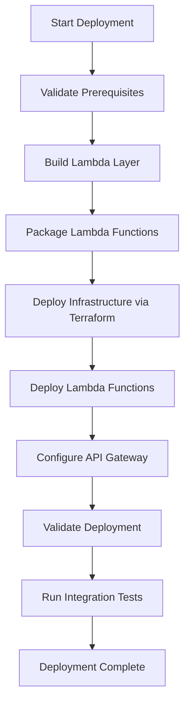
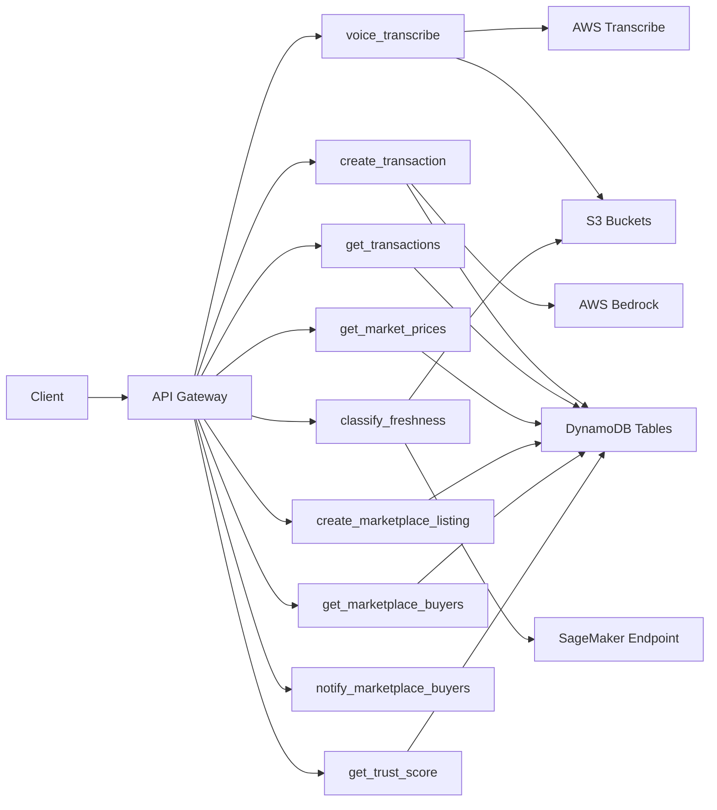

# Design Document: AWS Deployment and Testing

## Overview

This design specifies the deployment and testing infrastructure for the Smart Vendors serverless backend on AWS. The system uses Terraform for infrastructure as code, shell scripts for Lambda packaging and deployment, and Python scripts for automated testing. The deployment process is idempotent, supports multiple environments (dev, staging, prod), and includes comprehensive validation at each stage.

The deployment architecture follows AWS serverless best practices with Lambda functions, API Gateway for HTTP endpoints, DynamoDB for data persistence, S3 for object storage, and integrations with AWS AI services (Bedrock, Transcribe, SageMaker).

## Architecture

### Deployment Pipeline



### Component Architecture



## Components and Interfaces

### 1. Deployment Orchestrator

**Purpose**: Coordinates the entire deployment process

**Interface**:
```python
class DeploymentOrchestrator:
    def validate_prerequisites() -> ValidationResult
    def deploy_infrastructure() -> InfrastructureResult
    def deploy_lambda_functions() -> DeploymentResult
    def validate_deployment() -> ValidationResult
    def run_integration_tests() -> TestResult
    def rollback_deployment(version: str) -> RollbackResult
```

### 2. Lambda Packager

**Purpose**: Packages Lambda functions with dependencies

**Interface**:
```python
class LambdaPackager:
    def create_lambda_layer(requirements_path: str) -> LayerArtifact
    def package_function(function_name: str, include_shared: bool) -> FunctionArtifact
    def calculate_package_size(artifact: FunctionArtifact) -> int
```


### 3. Infrastructure Manager

**Purpose**: Manages Terraform-based infrastructure deployment

**Interface**:
```python
class InfrastructureManager:
    def terraform_init() -> bool
    def terraform_plan() -> PlanResult
    def terraform_apply() -> ApplyResult
    def get_outputs() -> Dict[str, str]
    def terraform_destroy() -> bool
```

### 4. Lambda Deployer

**Purpose**: Deploys packaged Lambda functions to AWS

**Interface**:
```python
class LambdaDeployer:
    def create_or_update_function(
        function_name: str,
        artifact: FunctionArtifact,
        role_arn: str,
        environment_vars: Dict[str, str],
        memory_mb: int,
        timeout_seconds: int
    ) -> FunctionMetadata
    
    def attach_layer(function_name: str, layer_arn: str) -> bool
    def publish_version(function_name: str) -> str
    def get_function_status(function_name: str) -> FunctionStatus
```

### 5. API Gateway Configurator

**Purpose**: Configures API Gateway routes and integrations

**Interface**:
```python
class APIGatewayConfigurator:
    def create_route(
        path: str,
        method: str,
        lambda_arn: str
    ) -> RouteMetadata
    
    def enable_cors(api_id: str) -> bool
    def deploy_stage(api_id: str, stage_name: str) -> StageMetadata
    def get_endpoint_url(api_id: str, stage_name: str) -> str
```

### 6. Test Runner

**Purpose**: Executes deployment validation and integration tests

**Interface**:
```python
class TestRunner:
    def test_lambda_function(
        function_name: str,
        test_payload: Dict[str, Any]
    ) -> TestResult
    
    def test_api_endpoint(
        url: str,
        method: str,
        payload: Dict[str, Any]
    ) -> TestResult
    
    def test_dynamodb_operations(table_name: str) -> TestResult
    def test_ai_service_integration(service: str) -> TestResult
    def test_end_to_end_workflow(workflow_name: str) -> TestResult
```

### 7. Validation Service

**Purpose**: Validates deployment state and resource availability

**Interface**:
```python
class ValidationService:
    def validate_lambda_functions(function_names: List[str]) -> ValidationResult
    def validate_dynamodb_tables(table_names: List[str]) -> ValidationResult
    def validate_s3_buckets(bucket_names: List[str]) -> ValidationResult
    def validate_api_gateway(api_id: str) -> ValidationResult
    def validate_ai_services(services: List[str]) -> ValidationResult
```

## Data Models

### DeploymentConfiguration

```python
@dataclass
class DeploymentConfiguration:
    aws_region: str
    environment: str  # dev, staging, prod
    project_name: str
    lambda_functions: List[LambdaFunctionConfig]
    dynamodb_tables: List[DynamoDBTableConfig]
    s3_buckets: List[S3BucketConfig]
```

### LambdaFunctionConfig

```python
@dataclass
class LambdaFunctionConfig:
    name: str
    handler: str
    runtime: str
    memory_mb: int
    timeout_seconds: int
    environment_vars: Dict[str, str]
    required_permissions: List[str]
    api_routes: List[APIRoute]
```

### APIRoute

```python
@dataclass
class APIRoute:
    path: str
    method: str  # GET, POST, PUT, DELETE
    lambda_function: str
```

### TestCase

```python
@dataclass
class TestCase:
    name: str
    test_type: str  # lambda, api, dynamodb, ai_service, end_to_end
    target: str
    payload: Dict[str, Any]
    expected_status: int
    expected_response_schema: Dict[str, Any]
```

### DeploymentResult

```python
@dataclass
class DeploymentResult:
    success: bool
    deployed_functions: List[str]
    api_endpoint_url: str
    resource_arns: Dict[str, str]
    errors: List[str]
    deployment_duration_seconds: float
```

### TestResult

```python
@dataclass
class TestResult:
    test_name: str
    passed: bool
    response_time_ms: float
    actual_response: Any
    error_message: Optional[str]
```


## Correctness Properties

A property is a characteristic or behavior that should hold true across all valid executions of a system—essentially, a formal statement about what the system should do. Properties serve as the bridge between human-readable specifications and machine-verifiable correctness guarantees.

### Property Reflection

After analyzing all acceptance criteria, I identified several areas of redundancy:
- Requirements 5.3 and 18.2 both specify on-demand billing for DynamoDB (combined into Property 5)
- Requirements 7.5 and 20.2 both specify API URL output (combined into Property 14)
- Several properties about "all functions" or "all tables" can be combined into comprehensive checks
- Configuration validation properties (memory, timeout, env vars) can be unified into configuration correctness properties

### Packaging and Artifact Properties

Property 1: Dependency inclusion completeness
*For any* Lambda function with a requirements.txt file, packaging that function should produce an artifact containing all dependencies listed in requirements.txt
**Validates: Requirements 1.1**

Property 2: Shared module inclusion
*For any* Lambda function that imports shared modules, packaging that function should produce an artifact containing all referenced shared modules
**Validates: Requirements 1.2**

Property 3: Large package layer usage
*For any* Lambda function package that exceeds 50MB uncompressed, the deployment system should use Lambda layers for dependencies instead of including them in the function package
**Validates: Requirements 1.3**

Property 4: Artifact creation completeness
*For any* set of Lambda functions, packaging should produce exactly one deployment artifact per function
**Validates: Requirements 1.4**

Property 5: Development dependency exclusion
*For any* Lambda function package, the artifact should not contain development dependencies (pytest, mypy, black) or test files
**Validates: Requirements 1.5**

### Deployment Configuration Properties

Property 6: Lambda configuration correctness
*For any* deployed Lambda function, its runtime, memory allocation, and timeout should match the values specified in its deployment configuration
**Validates: Requirements 2.2, 2.3, 2.4**

Property 7: Deployment state validation
*For any* completed deployment, all Lambda functions should report Active state
**Validates: Requirements 2.5**

### IAM Permission Properties

Property 8: IAM role creation completeness
*For any* set of Lambda functions, deployment should create exactly one IAM role per function
**Validates: Requirements 3.1**

Property 9: DynamoDB permission least-privilege
*For any* Lambda function requiring DynamoDB access, its IAM policy should grant permissions only to the DynamoDB tables specified in its configuration, and no others
**Validates: Requirements 3.2**

Property 10: S3 permission least-privilege
*For any* Lambda function requiring S3 access, its IAM policy should grant permissions only to the S3 buckets and prefixes specified in its configuration, and no others
**Validates: Requirements 3.3**

Property 11: AI service permission least-privilege
*For any* Lambda function requiring AI service access, its IAM policy should grant permissions only to the AI services (Bedrock, Transcribe, SageMaker) specified in its configuration
**Validates: Requirements 3.4**

Property 12: CloudWatch Logs universal access
*For any* deployed Lambda function, its IAM role should include permissions for CloudWatch Logs (CreateLogGroup, CreateLogStream, PutLogEvents)
**Validates: Requirements 3.5**

### Environment Variable Properties

Property 13: Environment variable completeness
*For any* Lambda function with required environment variables in its configuration, the deployed function should have all those environment variables set
**Validates: Requirements 4.1, 4.2, 4.3, 4.4**

Property 14: AWS region environment variable
*For any* deployed Lambda function, it should have an AWS_REGION environment variable set to the deployment region
**Validates: Requirements 4.5**

### Infrastructure Idempotency Properties

Property 15: DynamoDB table idempotency
*For any* DynamoDB table, running deployment twice should not create duplicate tables or modify existing table data
**Validates: Requirements 5.5**

Property 16: DynamoDB table configuration
*For any* created DynamoDB table, it should have on-demand billing mode and point-in-time recovery enabled
**Validates: Requirements 5.3, 5.4, 18.2**

Property 17: DynamoDB key schema correctness
*For any* DynamoDB table, its primary key and sort key configuration should match the schema specified in the infrastructure definition
**Validates: Requirements 5.2**

Property 18: S3 bucket idempotency
*For any* S3 bucket, running deployment twice should not create duplicate buckets or modify existing bucket contents
**Validates: Requirements 6.5**

Property 19: S3 bucket configuration
*For any* created S3 bucket (except static assets), it should have versioning enabled and public access blocked
**Validates: Requirements 6.2, 19.2**

Property 20: S3 CORS configuration
*For any* S3 bucket requiring frontend access, it should have CORS policies configured to allow appropriate origins and methods
**Validates: Requirements 6.3**

Property 21: Infrastructure update without recreation
*For any* existing AWS resource, updating its configuration should modify the resource in-place without destroying and recreating it, unless the update requires replacement
**Validates: Requirements 16.3**

Property 22: Infrastructure cleanup preservation
*For any* infrastructure destroy operation, DynamoDB tables and S3 buckets containing data should be preserved while compute resources are removed
**Validates: Requirements 16.5**

### API Gateway Properties

Property 23: API Gateway route completeness
*For any* set of Lambda functions with API route configurations, the deployed API Gateway should have exactly one route per configured endpoint
**Validates: Requirements 7.2**

Property 24: API Gateway CORS enablement
*For any* API Gateway endpoint, it should have CORS enabled with appropriate headers
**Validates: Requirements 7.3**

Property 25: API Gateway HTTP method correctness
*For any* API Gateway route, its HTTP method should match the method specified in the Lambda function's route configuration
**Validates: Requirements 7.4**

### Testing Properties

Property 26: Lambda test payload validity
*For any* Lambda function test, the test payload should conform to the function's expected input schema
**Validates: Requirements 9.1**

Property 27: Lambda response schema validation
*For any* successful Lambda function invocation, the response structure should match the function's expected output schema
**Validates: Requirements 9.2**

Property 28: API endpoint response validation
*For any* API endpoint test, the response should include the correct HTTP status code, CORS headers, and a body matching the expected schema
**Validates: Requirements 10.2, 10.3, 10.4**

Property 29: API endpoint test coverage
*For any* API endpoint, the test suite should include at least one test with valid input and one test with invalid input
**Validates: Requirements 10.5**

Property 30: DynamoDB round-trip integrity
*For any* test data written to a DynamoDB table, reading it back should return data equivalent to what was written
**Validates: Requirements 11.2**

Property 31: DynamoDB test cleanup
*For any* DynamoDB integration test, all test data should be removed from tables after test completion
**Validates: Requirements 11.5**

Property 32: Test result reporting completeness
*For any* test suite execution, the results should include pass/fail status for each individual test
**Validates: Requirements 9.5, 12.5**

Property 33: Workflow failure component identification
*For any* failed end-to-end workflow test, the error report should identify which specific component (Lambda function, DynamoDB table, AI service) caused the failure
**Validates: Requirements 13.4**

### Rollback and Version Management Properties

Property 34: Version preservation on failure
*For any* failed deployment, all previous Lambda function versions should remain available and unchanged
**Validates: Requirements 14.1**

Property 35: Rollback restoration
*For any* deployment followed by rollback, the Lambda function code and API Gateway configuration should be identical to the state before the deployment
**Validates: Requirements 14.2, 14.3**

Property 36: Post-rollback operational validation
*For any* completed rollback, all Lambda functions should be invocable and return successful responses for valid test inputs
**Validates: Requirements 14.4**

Property 37: Deployment history accumulation
*For any* sequence of deployments, the deployment history should contain records for all deployments in chronological order
**Validates: Requirements 14.5**

### Logging and Monitoring Properties

Property 38: Deployment step logging
*For any* deployment execution, the logs should contain timestamped entries for each deployment step (validation, packaging, infrastructure, Lambda deployment, testing)
**Validates: Requirements 15.1**

Property 39: Error logging detail
*For any* failed deployment step, the logs should contain the error message, stack trace (if applicable), and the step that failed
**Validates: Requirements 15.2**

Property 40: CloudWatch Logs configuration
*For any* deployed Lambda function, it should have CloudWatch Logs log group configured and accessible
**Validates: Requirements 15.3**

Property 41: Log access information
*For any* deployment result, it should include CloudWatch Logs URLs or CLI commands for accessing logs for each Lambda function
**Validates: Requirements 15.4**

Property 42: Deployment metrics reporting
*For any* deployment execution, the result should include deployment duration and status for each resource type (Lambda, DynamoDB, S3, API Gateway)
**Validates: Requirements 15.5**

### Security Properties

Property 43: DynamoDB encryption enablement
*For any* created DynamoDB table, it should have encryption at rest enabled
**Validates: Requirements 19.3**

Property 44: Lambda environment variable encryption
*For any* Lambda function with environment variables, those variables should be encrypted at rest
**Validates: Requirements 19.4**

Property 45: VPC configuration conditional
*For any* Lambda function with VPC requirements in its configuration, the deployed function should have VPC settings configured
**Validates: Requirements 19.5**

### Deployment Output Properties

Property 46: Resource ARN completeness
*For any* deployment, the deployment summary should include ARNs for all created resources (Lambda functions, DynamoDB tables, S3 buckets, API Gateway)
**Validates: Requirements 20.1**


## Error Handling

### Deployment Errors

**Pre-deployment Validation Failures**:
- Missing AWS credentials → Clear error message with setup instructions
- Insufficient IAM permissions → List required permissions
- AI services not available in region → Suggest alternative regions or demo mode
- Missing dependencies → List missing packages and installation commands

**Infrastructure Deployment Failures**:
- Terraform state lock conflicts → Provide unlock commands
- Resource quota limits → Identify which quota and current usage
- Resource name conflicts → Suggest alternative naming or cleanup
- Network connectivity issues → Retry with exponential backoff

**Lambda Deployment Failures**:
- Package size exceeds limits → Automatically switch to layer-based deployment
- Invalid runtime configuration → Report specific configuration error
- Permission denied errors → Identify missing IAM permissions
- Function code errors → Display CloudWatch Logs for debugging

**API Gateway Configuration Failures**:
- Route conflicts → Identify conflicting routes
- Integration errors → Verify Lambda function exists and has correct permissions
- CORS configuration errors → Validate CORS settings

### Testing Errors

**Lambda Function Test Failures**:
- Function timeout → Increase timeout or optimize function
- Memory limit exceeded → Increase memory allocation
- Unhandled exceptions → Display full stack trace from CloudWatch
- Invalid response format → Show expected vs actual schema

**Integration Test Failures**:
- DynamoDB access denied → Verify IAM permissions
- S3 access denied → Verify IAM permissions and bucket policies
- AI service throttling → Implement retry with exponential backoff
- Network timeouts → Increase test timeout or check service health

**End-to-End Test Failures**:
- Workflow step failures → Identify which step failed and why
- Data inconsistencies → Report expected vs actual data state
- Timing issues → Add appropriate waits between steps

### Rollback Errors

**Rollback Failures**:
- Previous version not found → List available versions
- Rollback permission denied → Verify IAM permissions
- Partial rollback → Report which components rolled back successfully
- State inconsistency → Provide manual recovery steps

### Error Recovery Strategies

1. **Automatic Retry**: Network errors, throttling, transient failures (3 retries with exponential backoff)
2. **Graceful Degradation**: AI service unavailable → Use demo mode or cached responses
3. **Partial Deployment**: Continue deploying other components if one fails, report partial success
4. **State Recovery**: Maintain deployment state to resume from failure point
5. **Manual Intervention**: Provide clear instructions for errors requiring manual fixes

## Testing Strategy

### Testing Approach

The deployment and testing system uses a dual testing approach:

1. **Unit Tests**: Verify specific deployment components, configuration generation, and error handling
2. **Property-Based Tests**: Verify universal properties across different deployment configurations and inputs

Both testing approaches are complementary and necessary for comprehensive coverage. Unit tests validate specific scenarios and edge cases, while property-based tests ensure correctness across a wide range of inputs through randomization.

### Property-Based Testing Configuration

**Library**: Use Hypothesis for Python-based property testing
**Minimum Iterations**: 100 iterations per property test
**Test Tagging**: Each property test must include a comment with format:
```python
# Feature: aws-deployment, Property {number}: {property_text}
```

### Test Categories

**1. Packaging Tests**
- Unit tests: Verify specific package structures, dependency resolution
- Property tests: Properties 1-5 (dependency inclusion, shared modules, layer usage, artifact creation, exclusions)

**2. Configuration Tests**
- Unit tests: Verify Terraform syntax, variable substitution, specific configurations
- Property tests: Properties 6-7, 13-14, 16-17 (Lambda config, env vars, table config, key schemas)

**3. Permission Tests**
- Unit tests: Verify specific IAM policy structures, permission boundaries
- Property tests: Properties 8-12 (role creation, least-privilege for DynamoDB/S3/AI, CloudWatch access)

**4. Idempotency Tests**
- Unit tests: Verify specific resource update scenarios
- Property tests: Properties 15, 18, 21-22 (table/bucket idempotency, update behavior, cleanup)

**5. API Gateway Tests**
- Unit tests: Verify specific route configurations, CORS headers
- Property tests: Properties 23-25 (route completeness, CORS enablement, HTTP method correctness)

**6. Integration Tests**
- Unit tests: Test specific Lambda invocations, DynamoDB operations, AI service calls
- Property tests: Properties 26-33 (payload validity, response validation, round-trip integrity, test coverage, cleanup)

**7. Rollback Tests**
- Unit tests: Test specific rollback scenarios
- Property tests: Properties 34-37 (version preservation, restoration, validation, history)

**8. Monitoring Tests**
- Unit tests: Verify specific log formats, metric collection
- Property tests: Properties 38-42 (step logging, error logging, CloudWatch config, log access, metrics)

**9. Security Tests**
- Unit tests: Verify specific security configurations
- Property tests: Properties 43-45 (encryption, VPC configuration)

**10. Output Tests**
- Unit tests: Verify specific output formats
- Property tests: Property 46 (ARN completeness)

### Test Execution Order

1. **Pre-deployment**: Packaging tests, configuration tests
2. **During deployment**: Permission tests, idempotency tests
3. **Post-deployment**: Deployment validation, Lambda function tests, API Gateway tests
4. **Integration phase**: DynamoDB tests, AI service tests, end-to-end workflow tests
5. **Rollback verification**: Rollback tests (optional, run on-demand)

### Test Data Management

**Test Data Strategy**:
- Use isolated test environment (separate AWS account or dedicated test stage)
- Generate random test data for property-based tests
- Use fixed test data for unit tests and examples
- Clean up all test data after test completion
- Use DynamoDB test tables with TTL for automatic cleanup

**Test Fixtures**:
- Sample audio files for transcription testing
- Sample images for freshness classification testing
- Sample transaction data for extraction testing
- Mock AI service responses for offline testing

### Continuous Testing

**Deployment Pipeline Integration**:
- Run packaging and configuration tests before deployment
- Run deployment validation tests after infrastructure deployment
- Run integration tests after Lambda deployment
- Fail deployment if critical tests fail
- Generate test report with all results

**Test Reporting**:
- Summary: Total tests, passed, failed, skipped
- Details: Individual test results with timing
- Errors: Full error messages and stack traces for failures
- Coverage: Which requirements are validated by passing tests
- Recommendations: Suggested fixes for failed tests

